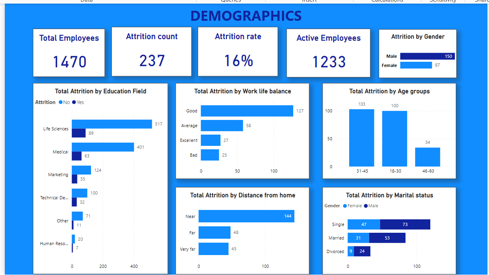
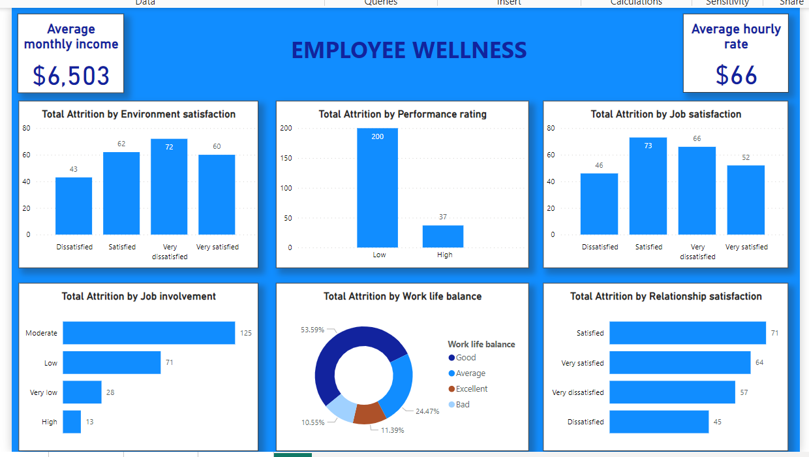
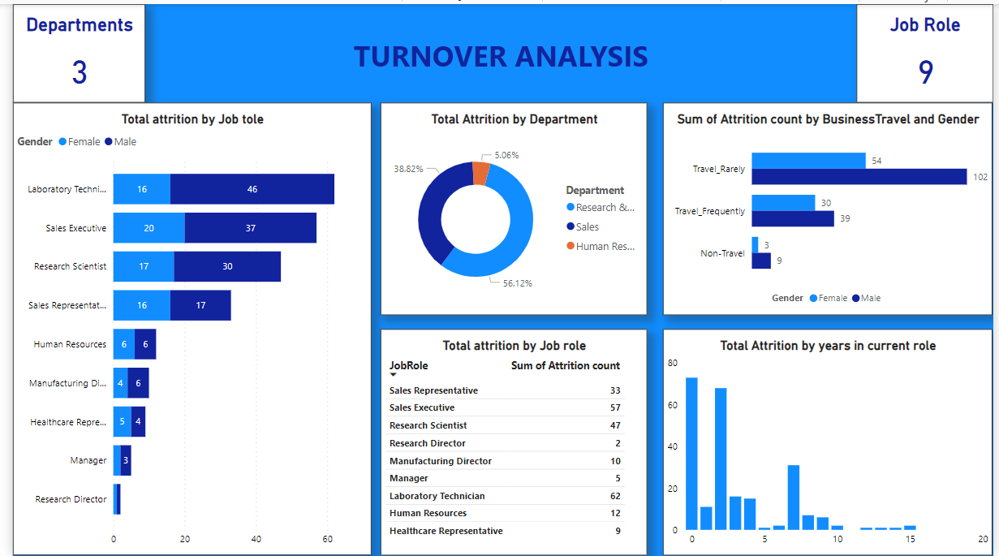

# HR ANALYTICS

This is an analysis of employee statistics for an organisation

**DOCUMENTATION OUTLINE**
- [Project overview](#project-overview)
- [Data Sources](#data-sources)
- [Tools for analysis](#tools-for-analysis)
- [Data Cleaning, Preparation and Transformation](#data-cleaning-preparation-and-transformation)
- [Results and findings](#results-and-findings)
- [Recommendations](#recommendations)

## Project overview
This project is to tell a story on attrition based on employee statistics and analyze various metrics related to the 

workforce, such as employee attrition, performance rating, job satisfaction, etc. 

### The project insight is divided into 4 namely;

- Demographics- this summarizes employee statistics such as age group, gender, marital status, etc, 

- Employee wellness provides insights to performance ratings, job satisfactions, work life balance.

- Turnover Analysis I shows employee attrition by job roles, departments, years in current role, etc.

- Turnover Analysis II shows attrition by monthly income, overtime, etc.

## Data Sources

The data was provided by the SkilHarvest Instructor in xls format and was loaded into Power BI for analysis

## Tools for analysis

Power BI [You can find it here](https://powerbi.microsoft.com/en-us/downloads/)

## Data Cleaning, Preparation and Transformation

The data was checked for blanks and duplicates.

- I went on to create data groups to aggregate certain values together so as to form meaningful subsets.

- For Work life balance, I created groups using lists and Grouped 1 as Bad, 2 as Average, 3 as Good and 4 as Excellent."

- Job involvement was grouped as Very low, Low, Moderate, High for values 1, 2, 3 and 4 respectively

- For distance from home, 1-10 is considered near, 10-20 is considered far and 20 – 30 is considered very far. 

- The Performance Rating column with values 3 and 4 were grouped to "Low" and "High" respectively

- Job, environmental and relationship satisfaction was rated on a scale ranging of 1 to 4. 

- On the satisfaction scale, 1 represents "very dissatisfied," 2 stands for "dissatisfied," 3 signifies "satisfied," and 4 indicates "very satisfied." 

## Results and findings

### Insights from the analysis

Major KPIs at a glance

1. Total Employees: there are 1470 employees in the dataset and 1,233 are active employees.
2. Attrition Count: 237 employees have left the company.
3. Attrition Rate: The attrition rate is approximately 16%.
4. Average Monthly Income: The average monthly income for employees is $6,503.
5. Average Hourly Rate: Employees earn an average hourly rate of $66.
6. There are 3 Departments with 9 different job roles
   
### DEMOGRAPHICS
  

### Age Groups:

- The 31-45 age group has the most employees but not the highest attrition rate.
  
- The 18-30 age group has a higher attrition rate relative to its total number.

### Distance from Home:

- Employees living near the workplace have higher attrition compared to those living far away.

### Marital Status:
 
- Single employees have a higher attrition rate compared to married or divorced individuals.

### Education Field:

- Life Sciences has the highest number of employees, but their attrition rate is relatively low.
  
- Technical Degree employees have the highest attrition rate.

### Gender:

- There are significantly more male employees and the attrition rates visibly differ across age groups, departments, job roles

  and satisafcation metrics.
  

### EMPLOYEE WELLNESS

### Environment Satisfaction: 

- The highest attrition occurs among employees who are very dissatisfied (72) and dissatisfied (43).

### Performance Rating: 

- Employees with low performance ratings (200) have a higher attrition rate compared to those with high performance ratings (37).

### Job Satisfaction: 

- Very dissatisfied employees (66) and satisfied employees (73) show significant attrition.

### Job Involvement: 

- Employees with moderate (125) and low (71) job involvement levels experience higher attrition compared to others

### Relationship Satisfaction: 

- Attrition is observed across different relationship satisfaction levels with satisfied being the highest at 71employees

### Work-Life Balance: 

- Work life balance is categorized as excellent, good, average, or bad. Employees with “Good” work-life balance experience higher attrition.

### TURNOVER ANALYSIS I

- For the different job roles attrition is highest amonsgst Laboratory Technicians and lowest in Research Director. Also male attrition is higher in almost all job roles 

- The donut chart showing Total Attrition by Department showing highest attrition in Research & Development (38.62%), Sales (55.12%), and Human Resources (5.26%).

- The stacked bar chart showing attrition count by Business Travel and Gender indicates that the men who rarely travel have a higher attrition rate than others 

- The table listing the sum of attrition for various job roles indicates that Sales representatives have the highest attrition

- The bar graph at the bottom right corner displaying the number of employees leaving their jobs based on how many years they’ve been in their current role.

- Those employed within the first 3 years have a higher attrition rate than those who have stayed significnatly longer with the organization

## Recommendations
